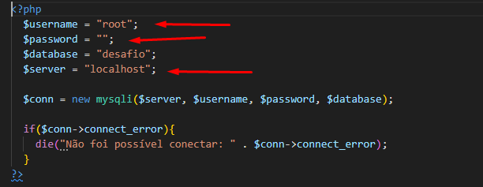

# INICIE DA SEGUINTE FORMA A IMPLEMENTAÇÃO

Bom deve se criar um banco de dados para que seja salvou utilizeo o MYSQL para realizar isso,
O codigo da tabela está na pasta arquivos com o nome do arquivo "codigo.sql" copie e cole no MYSQL para gerar a tabela.

# CONExÃO DO PHP COM BANCO DE DADOS

Utilizei o xamp para fazer essa conexao então precisa ser alterado o username, password, e senha caso seja diferente do qual utilizei 